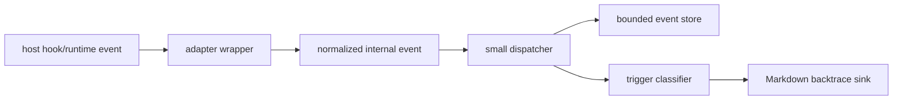

# HaltTrace

HaltTrace is local failure automation for AI coding agents. It watches host hook/runtime events, keeps a bounded local event history, writes a local Markdown backtrace when progress involuntarily halts, and can turn that dump into deterministic triage or a handoff prompt.

HaltTrace uses an spdlog-inspired dispatch architecture: host hook events are normalized into internal events, routed through a small dispatcher, and handled by independent sinks. The first sink is `BacktraceSink`, which keeps a bounded local event buffer and writes a diagnostic dump when the host reports an anomaly.

This is architectural inspiration only. HaltTrace does not depend on spdlog, does not reimplement spdlog, and does not use the router as an enforcement gate.

HaltTrace is observational only. It does not approve, deny, retry, veto, emit host control JSON, or send network traffic by default.

> Portfolio position: coding-agent observability, hook/plugin adapters, local diagnostic tooling.

## Why This Problem

Coding-agent sessions can stop at host hook, tool, permission, runtime, or plugin boundaries. When that stop is unexpected, the useful evidence is often spread across recent tool calls, hook payloads, stderr/stdout tails, and local state. A normal log stream is either too noisy to review quickly or too sensitive to share safely.

HaltTrace frames the problem as a bounded local observability problem: keep enough recent context to explain an involuntary halt, but avoid becoming a policy engine, retry system, or networked telemetry product.

## Method



## Engineering Decisions

| Decision | Alternatives Considered | Why | Tradeoff |
| --- | --- | --- | --- |
| Observer-only behavior | approve/deny/retry/veto host actions | Diagnostics should not change the agent's control flow or become a hidden safety gate | HaltTrace cannot automatically recover a halted session |
| Local bounded storage | remote telemetry or full log capture | Keeps sensitive session context local and limits retention risk | Cross-machine aggregation is intentionally out of scope |
| Host adapters share one core contract | separate Claude/Codex implementations | Proves the router/sink contract across structurally different hook surfaces | Adapter-specific edge cases still need hardening |
| Markdown incident dumps | raw JSON-only logs | Humans can review the halt context quickly during debugging | Requires careful redaction/truncation policy |
| Explicit trigger policy | dump on every command/test failure | Ordinary failures are part of development; dumps should be reserved for unexpected halt conditions | Some noisy-but-useful events remain context only |
| Deterministic dump workflow | required LLM/provider integration | `latest`, `explain`, `handoff`, and `doctor` work locally with no network or API key | Triage is useful but intentionally not a full AI repair agent |

## AI-Assisted Engineering Record

AI was used to pressure-test the boundary between observability and control. The key review prompt was not "how can this tool intervene?", but "where could this accidentally become an enforcement surface, leak too much context, or overclaim universal runtime support?"

Several tempting claims were rejected: HaltTrace is not an MCP server, not a policy engine, not a mature universal agent-runtime framework, and not a complete Codex interception boundary. Those limits are part of the public README because the engineering value is in the contract discipline, not in overstating the tool.

## Validation Evidence

| Evidence | Meaning |
| --- | --- |
| `npm run build` | TypeScript compiles and plugin wrapper runtime is synced |
| `npm run typecheck` | Type contracts are checked without emitting files |
| `npm test` | Node's built-in test runner validates compiled tests; latest documented run passed 31/31 |
| `tests/codex-contract.test.ts` | Codex context-only events, ordinary Bash non-triggers, `apply_patch` failure triggers, and MCP/tool exception triggers are pinned |
| Claude/Codex wrapper paths | Two host adapters use the same core/router/sink contract |
| Trigger policy table | Expected dump vs non-dump behavior is documented for review |
| Privacy/storage section | Local state, bounded retention, and sharing caveats are explicit |
| `halttrace latest/explain/handoff/doctor` | Captured dumps can be consumed as local failure automation |
| `halttrace-dump-analysis` skill | Claude/Codex agents can turn a dump into a goal-mode recovery plan |

## Known Limits

- The Codex path is experimental and does not intercept every tool path.
- HaltTrace observes events; it does not approve, deny, retry, or recover sessions.
- Redaction is defense-in-depth, not a guarantee, so generated dumps must be reviewed before sharing.
- Networked sinks, MCP server behavior, and mature universal-host claims are outside the current MVP.

## Current Status

HaltTrace is currently:

- a TypeScript/Node package named `halttrace`
- a stable Claude Code hook/plugin wrapper under `plugins/claude-code`
- an experimental Codex hook/plugin wrapper under `plugins/codex`
- an spdlog-inspired local event router, bounded event store, trigger classifier, and Markdown backtrace sink
- a deterministic dump-reading CLI workflow: `latest`, `explain`, `handoff`, and `doctor`
- an agent-facing `halttrace-dump-analysis` skill packaged with the plugin wrappers for goal-mode recovery plans
- a Universal MVP in the narrow contract sense: two structurally different host adapters now use the same core/router/sink contract

HaltTrace is not currently:

- an MCP server
- a tool server exposing callable tools
- a policy engine or safety gate
- a mature universal agent-runtime framework

The Codex path is intentionally labeled experimental. Current OpenAI Codex hook docs list support for `Bash`, `apply_patch` (with `Edit`/`Write` matcher aliases), and MCP tool names, but Codex is not a complete interception boundary. If a local Codex build or session only emits lifecycle, permission, stop, and ordinary Bash events, HaltTrace records context only and will not produce a backtrace dump until Codex emits an anomaly-bearing `apply_patch`, MCP, or explicit tool-exception event.

## Requirements

- Node.js 20 or newer
- npm
- Claude Code, when using the Claude Code plugin wrapper
- Codex CLI/App with hooks/plugins support, when using the Codex wrapper

Codex support is build-sensitive. Current OpenAI docs include Windows-specific hook configuration, but this project has only smoke-tested the Codex wrapper and manifest on this Windows PC; full plugin hook activation still needs verification on the Codex build/platform you intend to use.

## Install From Source

```sh
git clone <repo-url> halttrace
cd halttrace
npm install
npm run build
```

The build compiles TypeScript and syncs the built CLI runtime into both plugin wrappers:

```text
plugins/claude-code/dist/src/
plugins/codex/dist/src/
```

## Failure Automation CLI

The observer plugin creates dumps. The CLI workflow consumes those dumps:

```sh
halttrace latest
halttrace explain
halttrace handoff
halttrace doctor
```

`[dump.md]` is optional for dump-consuming commands. When omitted, HaltTrace reads the latest dump for the selected state root/project/session.

- `halttrace latest` prints the newest local dump path.
- `halttrace explain [dump.md]` prints deterministic local triage: trigger, host, session, files, likely cause, evidence previews, and next checks.
- `halttrace handoff [dump.md]` prints a prompt another agent can use to continue from the dump.
- `halttrace doctor [dump.md]` inspects the latest dump for local hook, storage, dump-mode, and evidence health.

Short npm bin aliases are also available:

```sh
halttrace-latest
halttrace-explain
halttrace-handoff
halttrace-doctor
```

On PowerShell, import the bundled alias module to get C++-style names for the current session:

```powershell
Import-Module ./scripts/halttrace-powershell-aliases.psm1
halttrace:explain
halttrace:doctor
```

Use `--state-root <dir>` when reading from a custom state root, `--cwd <path>` to filter to a project hash, `--session <id>` to filter to one session, and `--json` for machine-readable output.

These commands only read local dump files. They do not repair code, approve permissions, retry failed actions, mutate hook configuration, call an AI provider, or send network traffic.

The Claude and Codex plugin wrappers also package a `halttrace-dump-analysis` skill. When a dump exists, the skill creates or tracks one recovery goal, runs `latest`/`explain`/`doctor`/`handoff` as needed, and writes a recovery plan with evidence, next steps, verification commands, risks, and unknowns.

## Install With Claude Code Plugin Manager

From this checkout on your PC:

```sh
claude plugin marketplace add ./ --scope user
claude plugin install halttrace@halttrace --scope user
```

After the GitHub repository is available, a fresh machine can register the public repo as a marketplace instead:

```sh
claude plugin marketplace add FrogRim/halttrace --scope user
claude plugin install halttrace@halttrace --scope user
```

Verify the install:

```sh
claude plugin validate ./plugins/claude-code
claude plugin details halttrace
```

## Claude Code Plugin Setup

The Claude Code plugin lives at:

```text
plugins/claude-code/
  .claude-plugin/plugin.json
  hooks/hooks.json
  scripts/halttrace.mjs
```

Load it from a source checkout:

```sh
claude --plugin-dir ./plugins/claude-code
```

Claude Code plugin documentation describes plugins as directories with `.claude-plugin/plugin.json`, with hook configuration in `hooks/hooks.json` at the plugin root. HaltTrace follows that layout.

The hook command is:

```sh
node "$CLAUDE_PLUGIN_ROOT/scripts/halttrace.mjs"
```

The wrapper reads Claude Code hook JSON from stdin, forwards it to the built HaltTrace CLI, surfaces only HaltTrace diagnostic/backtrace lines, and exits `0`.

## Codex Plugin Setup Experimental

The Codex plugin lives at:

```text
plugins/codex/
  .codex-plugin/plugin.json
  hooks/hooks.json
  scripts/halttrace.mjs
```

The repository also includes a local Codex marketplace descriptor:

```text
.agents/plugins/marketplace.json
```

Codex plugin distribution and install surfaces are still moving. If your Codex build supports marketplace-backed plugin enablement, add this repo as a marketplace and enable `halttrace`. If it only supports direct hook files, wire the same wrapper command from `plugins/codex/hooks/hooks.json` into your user or project Codex hooks config.

Local Windows validation is limited to the Node wrapper, manifest, marketplace metadata, and packaged smoke flow because the installed Codex CLI exposed marketplace management commands but no complete plugin enable/install flow for hook activation. Treat full Codex plugin activation as an environment-specific verification step.

The Codex hook command is:

```sh
node "${PLUGIN_ROOT}/scripts/halttrace.mjs"
```

Codex plugin hooks receive `PLUGIN_ROOT` and `PLUGIN_DATA`; Codex also exposes `CLAUDE_PLUGIN_ROOT` and `CLAUDE_PLUGIN_DATA` for compatibility. HaltTrace prefers `PLUGIN_DATA` for Codex plugin storage unless `HALTTRACE_STATE_DIR` is set.

The Codex wrapper deliberately keeps stdout empty. This avoids accidentally returning hook control JSON or invalid Stop-hook output. Backtrace paths and observer diagnostics are written to stderr as `[halttrace] ...` lines.

## What It Observes

### Claude Code

| Claude Code hook | HaltTrace use | Trigger behavior |
| --- | --- | --- |
| `PreToolUse` | Records upcoming tool activity | Context only |
| `PostToolUse` | Records completed tool activity | Context only |
| `PostToolUseFailure` | Classifies failed tool activity | Triggers only for tool exceptions or edit-apply failures; ordinary command failures remain context |
| `PermissionDenied` | Records host-blocked tool attempts | Triggers `host-blocked` |
| `StopFailure` | Records distinguishable unrecoverable host stop failures | Triggers unless marked user-intended |
| `SessionEnd` | Records session closure | Context only |

### Codex Experimental

| Codex hook | HaltTrace use | Trigger behavior |
| --- | --- | --- |
| `SessionStart` | Records session start context | Context only |
| `UserPromptSubmit` | Records prompt-turn context | Context only |
| `PreToolUse` | Records supported tool input | Context only |
| `PermissionRequest` | Records approval-request context | Context only; HaltTrace does not decide |
| `PostToolUse` | Records supported tool output | Can trigger only when Codex emits an explicit `apply_patch` failure or explicit unhandled tool exception; ordinary command failures remain context |
| `Stop` | Records turn-stop context | Context only |
| `SubagentStart` / `SubagentStop` | Records subagent lifecycle context | Context only |

As of the current OpenAI Codex hook docs, `PreToolUse`, `PermissionRequest`, and `PostToolUse` matchers include `Bash`, `apply_patch` (also matched by `Edit` or `Write`), and MCP tool names. That support is still not a complete interception boundary, and HaltTrace treats Codex as an observer surface, not an enforcement surface.

The practical trigger reality is conservative: Codex sessions that only surface lifecycle events, `PermissionRequest`, `Stop`, and ordinary `Bash` `PostToolUse` results will build a useful event buffer but will not emit a backtrace dump. On Codex, dump generation currently depends on Codex emitting an anomaly-bearing `apply_patch`, MCP, or explicit tool-exception event into `PostToolUse`.

## Trigger Policy

HaltTrace writes a dump only when progress involuntarily and unexpectedly halts.

Triggers:

- `host-blocked`
- `tool-exception`
- `edit-apply-failure`
- `host-unrecoverable-error`, when distinguishable from a user stop

Non-triggers:

- non-zero command exits
- test failures
- lint failures
- typecheck failures
- ordinary feedback from tools
- user-intended stops
- normal approval waits
- inferred stalls
- repeated same-step failures

## Output

When a trigger fires, HaltTrace writes a local Markdown incident report and surfaces the dump path:

```text
[halttrace] backtrace dump: <path-to-incident.md>
```

Claude Code surfaces this line on stdout because Claude hook output accepts plain observer text for the events HaltTrace uses. Codex surfaces it on stderr to keep stdout empty and avoid control-output ambiguity.

A generated report includes:

- incident metadata
- a recent event table
- trigger event details
- captured args, stderr, stdout, diff, or error blocks only when the triggering event contains them
- redaction and truncation notes

See [examples/sample-report.md](examples/sample-report.md) for an illustrative richer report.

## Privacy And Storage

By default, HaltTrace stores data outside the repository:

| Platform | Default state root |
| --- | --- |
| Linux | `$XDG_STATE_HOME/halttrace` or `~/.local/state/halttrace` |
| macOS | `~/Library/Logs/halttrace` |
| Windows | `%LOCALAPPDATA%\halttrace` |

When Claude Code provides `CLAUDE_PLUGIN_DATA`, the Claude plugin wrapper prefers that location unless `HALTTRACE_STATE_DIR` is set. When Codex provides `PLUGIN_DATA`, the Codex plugin wrapper prefers that location unless `HALTTRACE_STATE_DIR` is set.

The Windows row is a storage-path default, not a claim that every Codex hook/plugin activation flow has been fully verified on Windows.

Storage is sharded by project hash and session ID:

```text
<state-root>/<project-hash>/<session-id>/
  events.jsonl
  incident-state.json
  <incident-id>.md
```

Dump content is rich but bounded. HaltTrace may include redacted/truncated command text, args, stdout tail, stderr tail, error details, and diff hunks when those fields are present on the host event. It does not include full file contents, full stdout, or full repository diffs by default.

Redaction is defense-in-depth, not a guarantee. Treat dumps as local diagnostic files and review them before sharing.

## Environment Variables

| Variable | Purpose | Default |
| --- | --- | --- |
| `HALTTRACE_STATE_DIR` | Override the state directory | Platform state root, or plugin data dir in plugin mode |
| `HALTTRACE_DUMP_MODE` | Choose dump content mode: `rich-local` or `metadata-only` | `rich-local` |
| `HALTTRACE_MAX_EVENTS` | Maximum retained events in the local ring buffer | `80` |
| `HALTTRACE_MAX_BYTES` | Approximate byte budget for retained events | `512000` |
| `HALTTRACE_COOLDOWN_MS` | Incident deduplication cooldown | `5000` |
| `HALTTRACE_ENTRY` | Override CLI entry path for plugin wrapper development | Built plugin CLI, then repo `dist` CLI |

Use metadata-only mode when command/output content should be omitted from both the durable event buffer and dumps:

```sh
HALTTRACE_DUMP_MODE=metadata-only claude --plugin-dir ./plugins/claude-code
```

PowerShell:

```powershell
$env:HALTTRACE_DUMP_MODE="metadata-only"; claude --plugin-dir ./plugins/claude-code
```

## Development

```sh
npm install
npm run typecheck
npm test
npm run clean
```

Available scripts:

| Command | What it does |
| --- | --- |
| `npm run build` | Compiles TypeScript and syncs both plugin builds |
| `npm run typecheck` | Runs TypeScript without emitting files |
| `npm test` | Builds, then runs Node's built-in test runner against compiled tests |
| `npm run clean` | Removes root `dist` |

Useful validation commands:

```sh
claude plugin validate ./plugins/claude-code
node plugins/codex/scripts/halttrace.mjs < codex-hook-payload.json
halttrace explain examples/sample-report.md
```

## Documentation Pattern

This README borrows structure from official/high-visibility Claude plugin, Codex plugin, and MCP-style projects without claiming HaltTrace is an MCP server.

Observed patterns:

- The Anthropic Claude Code plugin docs emphasize a clear plugin directory layout, separate `hooks/hooks.json`, and executable hook commands that receive JSON on stdin: <https://code.claude.com/docs/en/plugins>
- The Anthropic hooks reference documents event/matcher structure and host hook configuration, which maps well to HaltTrace's observed-hook table: <https://docs.anthropic.com/en/docs/claude-code/hooks>
- The OpenAI Codex hooks reference documents stdin JSON hook events, matcher support, output rules, and current limitations: <https://developers.openai.com/codex/hooks>
- The OpenAI Codex plugin build guide documents `.codex-plugin/plugin.json`, default `hooks/hooks.json`, and `PLUGIN_ROOT` / `PLUGIN_DATA`: <https://developers.openai.com/codex/plugins/build>
- The official Model Context Protocol servers README leads with scope, quick start, client configuration, and security caveats for reference implementations: <https://github.com/modelcontextprotocol/servers/blob/main/README.md>
- The GitHub MCP Server README documents installation, configuration modes, tool-surface controls, and security-relevant setup details: <https://github.com/github/github-mcp-server>

For HaltTrace, the useful pattern is: state scope first, show exact setup snippets, document observed host events, explain privacy/security, then link deeper architecture docs. The important difference is that HaltTrace observes host hooks and writes local backtraces; it does not expose MCP tools, resources, or prompts.

## More Docs

- [Architecture](docs/architecture.md)
- [Failure Automation Workflow](docs/failure-automation.md)
- [Sink API](docs/sink-api.md)
- [Behavioral Evaluation Log](docs/evaluation-log.md)
- [Security Policy](SECURITY.md)
- [Sample Incident Report](examples/sample-report.md)
- [Sample Handoff Prompt](examples/sample-handoff.md)

## Roadmap

Near-term:

- harden Claude Code and Codex plugin packaging against fresh-install edge cases
- expand real-incident evaluation with non-author testers
- improve backtrace usefulness without increasing sensitive-content risk
- make dump handoff workflows easier to invoke from host-specific agent skill surfaces

Later:

- add more host adapters only when they can pass the same core contract without weakening observer-only behavior
- keep the core host-neutral while adding adapters
- consider additional sinks only if they preserve the side-effect-only observer contract

Networked sinks, MCP server behavior, and mature universal-host claims are outside the current MVP.
